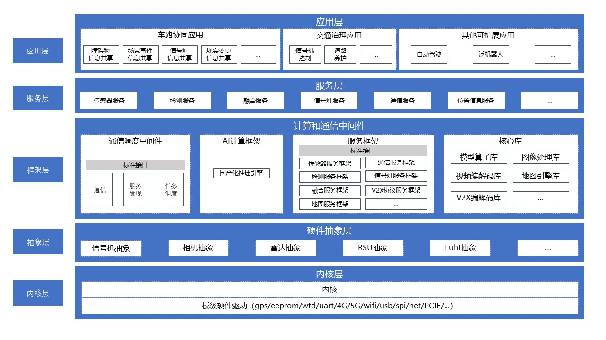
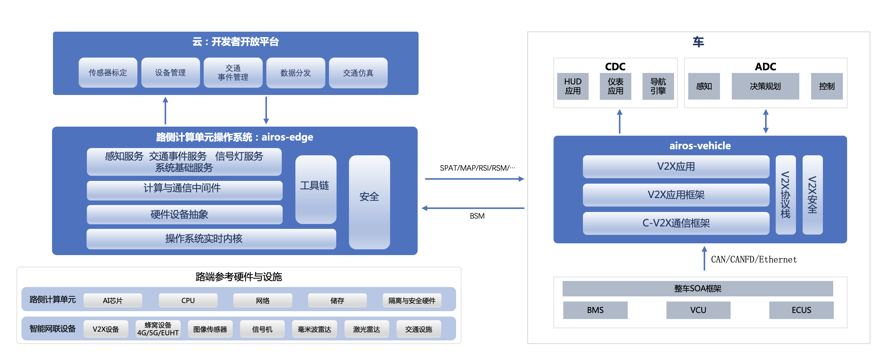
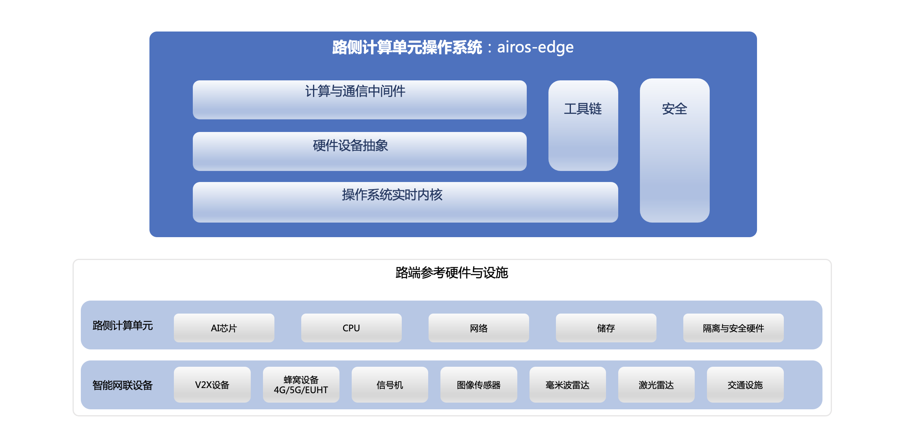

### 欢迎来到智路OS的Gitee仓库！

智路OS是全球首个开源开放的智能网联路侧单元操作系统（简称“智路OS”）， 是以高等级自动驾驶技术为牵引，沉淀出来的“车路云网图”一体化的智能交通基础软件平台。智路OS以开源开放，自主可控为核心理念，支撑开发者快速构建智能交通应用。

商务合作伙伴请访问[官方网站](https://www.apollo.auto/zhiluos) :D

------

## 目录

- [目录](#目录)
- [1. 介绍](#1-介绍)
- [2. 环境准备](#2-环境准备)
- [3. 最新版本](#4-最新版本)
- [4. 版本概述](#3-版本概述)
    - [智路OS 1.0Beta](#智路os-10beta)
    - [智路OS Preview版](#智路os-preview版)
- [5. 如果您想快速使用智路OS](#5-如果您想快速使用智路os)
  - [快速上手](#快速上手)
  - [关于测试与验证](#关于测试与验证)
- [6. 授权与许可](#6-授权与许可)
- [7. 联系我们](#7-联系我们)

## 1. 介绍

智路OS是一套完整的软件和服务开放系统，由路侧操作系统（airos-edge），车端（airos-vehicle）和云端开发者平台共同构成，为行业提供了统一的车路云开发环境。其中airos-edge自下而上分别由内核层，硬件抽象层、中间件层和服务层构成；airos-vehicle由V2X协议栈和应用服务框架组成；云端开放平台为开发者提供了标定，标注等开箱即用的工具集；开发者可基于智路OS快速搭建一套完整的车路协同或其他智能交通系统。

我们正在持续开源新的模块和功能，请查看依赖条件和安装步骤，做好构建启动智路OS的准备。您可以查看我们提供的版本概述，以更快速地了解智路OS的核心技术体系。

## 2. 环境准备
基础环境：
- 系统：Linux及发行版，内核5.4.0及以上版本，建议Ubuntu 18.04及以上版本
- CPU：X86_64、AArch64
- 内存：8G
- Docker：建议v20.10.0及以上版本

运行环境：

如需运行智路OS框架及示例算法，需要安装
- NVIDIA驱动：455.32.00及以上版本
- CUDA：11.1及以上版本
- NVIDIA容器工具：nvidia-docker2

## 3. 最新版本
#### 智路OS 2.0
智路OS 2.0正式版发布，airos-edge全新升级四大特性：

- 1.架构升级：重新定义标准服务、应用、设备接入，解耦框架与组件，提供更高的扩展能力
- 2.包管理：集成包管理工具，清晰的组件开发流程，提升开发效率
- 3.智路SDK：提供标准接口、SDK以及多版本集成开发环境，无需阅读源码即可入门组件开发
- 4.ARM支持：支持AArch64架构，更高的设备兼容性

路侧操作系统airos-edge技术架构:

智路OS 2.0路侧操作系统自下而上分别由内核层，硬件抽象层、框架层、服务层和应用层构成；提供了一系列抽象和框架，支持设备接入、服务、应用等组件开发。

相关文档请参考：[智路OS 2.0 快速开始](#5-如果您想快速使用智路os)

## 4. 版本概述

#### 智路OS 1.0

智路OS1.0正式版，除了已发布的1.0Beta内容，还包含：

- 感知服务框架与感知服务（2D检测，3D检测，行人结构化，机动车结构化，融合，跟踪，拥堵事件检测等）[Perception_Pipeline_QuickStart](./docs/04_Pipeline/Perception_Pipeline.md)
- 高精地图引擎定义preview版本，详细内容请参见:[Zhilu_Map_Preview](./docs/05_AirOS Tool/Zhilu_Map_Preview.md)

#### 智路OS 1.0Beta

2022年12月1日发布1.0Beta版本，基于《CSAE+53-2020+合作式智能运输系统+车用通信系统应用层及应用数据交互标准（第一阶段）》(以下简称“`DayI`”)的车路协同应用场景，开源了V2X协议栈实现，信号灯服务，车端开发框架和云端spat的解析渲染等功能。在本版本中，您可以通过智路OS快速搭建基于信号灯的闭环应用，也可以通过源码和工具自主实现一套基于智路OS的完整的车路协同系统。1.0Beta版包括以下内容：

- 路侧（airos-edge）：根据《道路交通信号控制机信息发布接口规范》（GA/T 1743-2020）协议和`DayI`（四跨和新四跨）消息集编解码，实现了信号灯服务的完整闭环链路，同时对中间件层进行了调整优化，增加了调试模拟工具，并对基础开发环境进行了升级，详细内容请参见[airos-edge](./docs/01_QuickStart/Airos_Edge_1.0_Quick_Start.md)；

- 车端（airos-vehicle）：开源了车端应用服务开发框架和示例应用demo（闯红灯预警、绿波车速引导），详细内容请参见[airos-vehicle](https://gitee.com/ZhiluCommunity/airos-vehicle)；

- V2X消息编解码（airos-v2x-msg）：开源了V2X协议栈-消息编解码模块，支持`DayI`（四跨和新四跨）消息集编解码。详细内容请参见[airos-v2x-msg](https://gitee.com/ZhiluCommunity/airos-v2x-msg)；

- 云端开发者平台：开发者平台为开发者提供了V2X消息解析和信号灯渲染等功能，后续我们还将继续开放设备标定标注等工具集，敬请期待；

- 模拟器：同时我们也准备了设备模拟器（信号机，OBU，RSU等），方便开发者快速开发和验证。比如信号机和采集卡的模拟器可以产生信号灯的样例数据。详细内容请参考[使用教程](./middleware/device_service/modules/traffic_light/simulator/README.md)。

#### 智路OS Preview版

2022年8月发布Preview版，面向不同开发者角色提供了不同的源码、SDK和工具。您可以在这个版本对智路OS整体框架进行快速验证。在发布智路OS1.0 beta版本后，我们对代码库进行了优化和调整，请参看1.0 beta版本详细介绍。历史版本issue归档至：[Preview_Version_Q&A](./docs/06_Others/Preview_Version_Q&A.md)          

1. 面向应用开发者：与智路OS交互的SDK。通过这些接口，您可以获取脱敏后的真实环境中的全量感知障碍物结构化数据、事件检测结果、交通信号灯消息、局部地图消息等。您可以基于开放数据自行完成如『交通事件检测』和『V2X场景』等应用。

2. 面向硬件设备开发者：设备抽象层。通过设备抽象层，您可以开发新的设备驱动器，并添加到智路OS的可支持设备列表，我们开放了为ins、lidar、camera，rsu等传感器设备接入的标准接口，同时提供了几种类型设备的测试工具。设备抽象库airos-al支持x86和aarch64平台的编译和使用。

3. 面向学习研究：OS内核和中间件。您可以通过了解内核和中间件的开发细节并对其进行能力扩展。

  

## 5. 如果您想快速使用智路OS

### 快速上手
从1.0 Beta版起，我们提供了快速体验智路OS的用户指南，您可以参考以下文档快速上手您感兴趣的部分。

版本指南：
| 版本             | 文档链接                                                     |
| ---------------- | ------------------------------------------------------------ |
| 智路OS 2.0       | [AirOS-Edge 2.0 QuickStart Guide](./docs/01_QuickStart/Airos_Edge_2.0_Quick_Start.md) |
| 智路OS 1.0       | [AirOS-Edge 1.0 QuickStart Guide](./docs/01_QuickStart/Airos_Edge_1.0_Quick_Start.md) |

功能指南：
| 版本             | 文档链接                                                     |
| ---------------- | ------------------------------------------------------------ |
| 信号灯Pipeline       | [Traffic Light Pipeline QuickStart Guide](./docs/04_Pipeline/Traffic_Light_Pipeline.md) |
| 感知Pipeline       | [Traffic Light Pipeline QuickStart Guide](./docs/04_Pipeline/Perception_Pipeline.md) |
| 智路OS开发手册       | [AirOS-Edge Developer Guides](https://airos-edge.readthedocs.io/)  |
| 车端应用         | [AirOS-Vehicle QuickStart Guide](https://gitee.com/ZhiluCommunity/airos-vehicle/blob/master/README.md)  |
| 开发者平台       | [Airos Developer Platform](https://airos.baidu.com)|

### 关于测试与验证

如果您已经基于开源代码，完成了相关研发工作（包括但不限于智能交通应用、设备接入、芯片适配等），希望能够在真实环境进行测试。我们在北京亦庄搭建了一套具备调试、测试、验证的联合实验室，将为您提供专业的实验环境和技术对接，欢迎您前来接洽。

联合实验室地址：中国北京市大兴区北京经济技术开发区宏达中路10号永晖大厦B座4层

联系方式：发送邮件至[zhiluos@163.com](mailto:zhiluos@163.com)

## 6. 授权与许可

智路OS 在 [Apache-2.0 license ](https://gitee.com/link?target=https%3A%2F%2Fgithub.com%2FApolloAuto%2Fapollo%2Fblob%2Fmaster%2FLICENSE)许可下提供。

## 7. 联系我们

如果您在使用智路OS的过程中遇到任何问题，欢迎通过以下方式联系我们：

- [Apollo官网问题反馈](http://rte.weiyun.baidu.com/api/imageDownloadAddress?attachId=d0bb3a5aaa5a430b86dcec44be56838d)
- 发送Email：[zhiluos@163.com](mailto:zhiluos@163.com)
- 提交Gitee Issue
