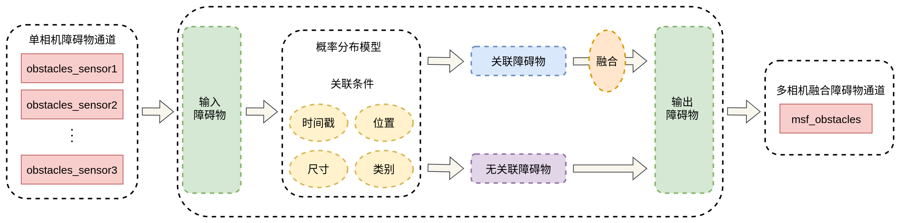
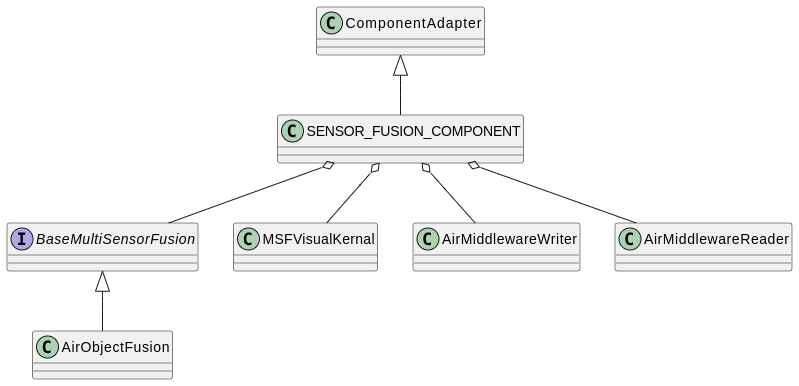

# Perception Fusion Service

多传感器融合感知模块的主要任务是接收各传感器感知的障碍物信息，融合这些障碍物信息，得到融合后的障碍物信息。

智路OS提供了融合组件的示例实现，基于误差建模概率分布结合轨迹、车道以及尺寸等多维度的联合概率方案，关联成功率大于98%。跟踪采用时间和空间相结合的卡尔曼滤波，将同一物体，不同传感器不同时刻的观测值进行滤波跟踪。

## 1.多传感器障碍物融合框图

## 2.多传感器障碍物融合类图

## 3.模块介绍
### 3.1 融合算法
3D融合关联模块基于概率分布模型来建立关联矩阵，对于关联融合所需的所有维度的信息（障碍物位置、类别、尺寸、车道信息、轨迹等），通过其概率分布来得到融合概率分布，概率最高点则为融合后的结果，协方差则为本次融合结果的置信度及融合分布。该方案关键在于推导多维概率分布相乘后的分布模型，以及确定每一个维度分布形式并估计分布的参数，并对各个维度解耦，在各自维度上进行概率融合。每个维度的概率融合都会对关联进行check。关联内核：匈牙利匹配。

### 3.2 融合可视化
**实现方式:**

通过opencv的gui功能将障碍物位置和尺寸等信息显示到屏幕中。

**使用方法：**

可视化包括对输入和输出障碍物的可视化，一共分为三种模式，可在可视化图形界面的上方通过鼠标滑动选择，也可用使用键盘的左右健进行模式切换。

- mode 0: 输入障碍物

- mode 1: 输出障碍物

- mode 2: 输入和输出混合

可以通过鼠标勾选显示的障碍物信息，包括障碍物ID、相机ID、障碍物类型、障碍物子类型、误差圆范围等。

其他使用介绍：

- y: 重置画布大小
- w s a d：移动显示范围

