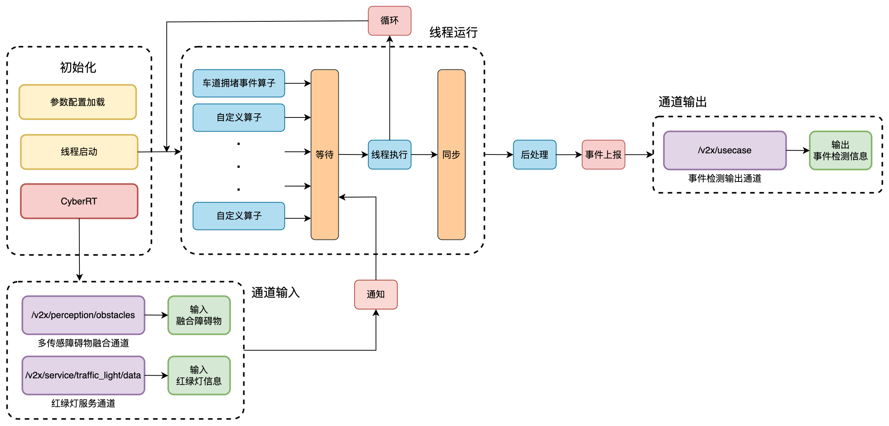

# AirOS APP

## 1 应用概述

智路OS应用层的主要任务是订阅框架内的各类服务消息，完成自定义的业务，比如事件检测、智能信控、V2X应用场景、车辆规划控制等。智路OS提供了多种应用的示例，包括：

- 事件检测：通过感知模块的输出，识别出特定事件，并发送到事件管理模块。
- 应用场景：订阅感知、事件管理模块的输出，完成V2X应用场景，组装V2X消息并发送到V2X协议栈，进为智能网联车辆和自动驾驶车辆提供服务。
- 系统监控：提供系统连接设备的监控，将设备状态发送到云端。
- 云端接入：订阅服务数据，处理后发送到云端平台，云端进行数据存储、处理和转发。

## 2 事件检测
### 2.1 事件检测


### 2.2 目录结构
```bash
usecase
├── algorithm # 事件算法类
├── base      # 组件类
├── common    # 基础类
└── map       # 地图服务类
```

## 3 应用场景
智路OS支持V2X应用场景，主要形式为V2I场景，包括：
- `traffic_light_adapter`接入信号机支持SPAT消息发送到车端，同时发送到云端平台
- `rsi_generator`基于感知服务及事件检测处理，支持发送RSI消息到车端
- `v2x_message_reporter`支持车端BSM消息的接收与上传
- `perception_adapter`感知事件及障碍物原始数据发送到云端平台

## 4 云端接入
智路OS提供了基于MQTT的云端接入SDK，位于base/common目录，开发者可以通过应用自定义配置接入支持标准MQTT Client SDK的云平台。同时，智路OS项目提供了[智路OS开发者平台](https://airos.baidu.com)供开发者体验路云链路，基于现有示例应用自定义连接配置并启动后，可在平台观测到系统数据。

### 4.1 系统配置
`cloud_adapter`云端接入服务提供了标准的MQTT客户端接入实现，开发者在项目编译完成后可以通过配置`/home/airos/os/app/conf/airos_v2x_application/v2x_config.flag`文件中的参数进行智路OS开发者平台接入。例如增加如下配置：
--cloud_mqtt_addr=mqtt://xxxx.iot.gz.baidubce.com
--cloud_mqtt_user=thingidp@xxxxxx|xxx|xx|MD5
--cloud_mqtt_passwd=xxxxxxxxxx

在开发者平台新增RSCU时，非企业用户的RSCU设备SN不可修改，开发者如需上传本机数据到平台测试，需要修改本机SN为平台分配的默认SN。
本机SN文件路径为`/etc/v2x/SN`，开发者可修改设备SN：
```bash
echo NEW_RSCU_SN | tee /etc/v2x/SN
```
如需root权限，可在镜像外直接使用docker exec进入开发镜像。

### 4.3 智路OS开发者平台
智路OS项目提供了[智路OS开发者平台](https://airos.baidu.com)供开发者体验路云链路，连接方式如下：  
- 1.注册智路OS开发者平台。   
- 2.在开发者平台注册RSCU设备，获取到设备SN后修改默认的SN文件。   
- 3.获取连接到平台的URL、用户名、密码，分别填入上述v2x_config.flag配置文件中的cloud_mqtt_addr、cloud_mqtt_user和cloud_mqtt_passwd。   
- 4.启动相应的信号灯或者感知pipeline，即可在开发者平台查看相应的数据结果。

更详细的开发者平台使用方式，请参考开发者平台提供的使用手册。