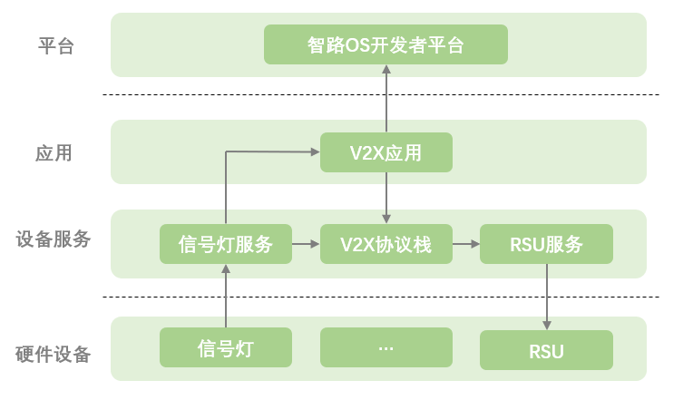

# Traffic Light Pipeline

智路OS信号灯Pipeline，提供了车路云信号灯全链路标准解决方案。
- 支持基于(GA/T 1743-2020)《道路交通信号控制机信息发布接口规范》标准的信号机设备接入
- 支持“四跨”、“新四跨”标准V2X消息ASN.1编解码
- 支持智路OS生态RSU设备接入实现
- 支持标准MQTT Client云端接入实现

## 1.信号灯处理流程



## 2.快速开始
编译完成获得产出后，可以使用`airos_launch traffic_light`拉起信号灯的整体处理流程。
执行以下命令：

```bash
source /home/airos/os/setup.bash # 初始化运行环境
airos_launch traffic_light # 拉起处理流程
```
项目内提供了基于GA/T 1743-2020标准的信号机模拟器，可以模拟真实信号机数据输出，启动方式：

```bash
cd /airos/middleware/device_service/modules/traffic_light/simulator
python3 gat1743_simulator.py &
```

## 3.模块介绍
### 3.1 信号灯服务
信号灯服务提供了基于(GA/T 1743-2020)标准的信号机设备接入。
接入服务包含通信、协议解析、自定义数据填充，最终输出具有丰富信息的信号灯数据，数据格式为：`traffic_light_service.proto`。信号灯服务在标准SPAT基础上提供了更多的信息，方便扩充，开发者可基于该服务实现各类V2X应用场景，例如：   
- 经过协议栈编解码后发送给车端，实现V2I的各种应用。
- 发送到云端平台进行信号灯实时数据展示、或通过Uu链路发送给车端。
- 可基于信号灯服务实现各类路侧应用场景，如闯红灯、信号控制优化等。

### 3.2 V2X应用
V2X应用中的信号灯消息适配器将信号灯服务数据转换为协议栈编码模块、云端接入模块需要的数据格式。
云端接入模块提供了标准的MQTT客户端接入实现，当前信号灯数据上传的topic为`upload/trafficlight/SN`，其中，SN为设备序列号。

### 3.3 V2X协议栈
V2X协议栈编解码模块提供了编解码的API和具体实现。   
协议栈编解码模块，当前兼容“四跨”、“新四跨”的消息编解码，输入为标准格式的proto文件，输出为ASN.1编码后的数据流。相比开发者直接操作ASN.1编码，极大降低了使用难度，且不容易出现内存泄露等问题。   
协议栈可支持多种协议的编解码，可在此基础上实现更高级的功能，例如使用云端控制切换协议栈版本，无需重启。本工程内引入的编解码库，具体实现详见项目库：airos-v2x-msg。   
具体实现方面，将编解码作为单独的模块启动，以模块间通信的方式代替API的调用，实现解耦，且易于调试。

### 3.4 RSU设备服务
RSU设备服务提供了智路OS生态通用RSU设备接入的具体实现，可便捷的接入生态内的RSU设备。

## 4.自定义配置
智路OS公共参数配置存放在`/home/airos/param`
### 4.1 信号机接入配置
如需接入支持的真实信号机，可修改信号机接入配置：
`device/traffic_light/gat_device/device.yaml`
```yaml
ip: 127.0.0.1     # 信号机IP
port: 10023       # 信号机接收端口
local_port: 10050 # 本地接收端口
protocol: udp     # 通信协议，默认UDP，支持TCP
```

### 4.2 信号灯服务
如需自定义信号灯数据内容，可修改服务配置：
`device/traffic_light/traffic_light.flag`
```
--city_code         # 城市名称
--region_id         # 区域ID，同SPAT定义中的region，一般取行政区划代码前两位
--cross_id          # 路口ID
--phase_to_direction_path   # 相位转换文件路径
```   

如需自定义相位，可修改相位转换配置，此文件用于将信号机的初始相位转换为自定义相位
`device/traffic_light/phase_to_direction.json`
```json
{
  "phase": [1, 2, 5, 6, 9, 10, 13, 14],
  "direction" :[27, 26, 37, 36, 7, 6, 17, 16]
}
```

相位示例：
|  | 直行 | 左转 | 右转 | 掉头 | 预留 |
| :----: | :----: | :----: | :----: | :----: | :----: |
| 东 | 1 | 2 | 3 | 4 | 5 |
| 东南 | 6 | 7 | 8 | 9 | 10 |
| 南 | 11 | 12 | 13 | 14 | 15 |
| 西南 | 16 | 17 | 18 | 19 | 20 |
| 西 | 21 | 22 | 23 | 24 | 25 |
| 西北 | 26 | 27 | 28 | 29 | 30 |
| 北 | 31 | 32 | 33 | 34 | 35 |
| 东北 | 36 | 37 | 38 | 39 | 40 |


### 4.3 接入RSU配置
如需接入智路OS生态RSU设备，可修改RSU接入配置：
`rsu/standard_rsu.yaml`
```yaml
ip : 127.0.0.1        # RSU IP
port : 11262          # RSU端口
local_port : 11263    # 本地绑定接收端口
local_ip: 127.0.0.1   # 本机IP
```

## 5.路车链路
智路OS项目提供了车端v2x应用框架airos-vehicle、包括应用场景、开发框架及系统环境，同时airos-vehicle提供了Fake OBU模块用于测试路车链路。开发者可以在没有RSU、OBU设备的情况下进行调试，只需要在同一个机器上启动两个项目即可。  
AirOS项目的RSU接入模块默认发送UDP数据到回环地址的`11262`端口，airos-vehicle的Fake OBU模块绑定了此端口，可以实现接入模块的协议解析、ASN.1解码操作、获取的数据可以用于V2I应用场景的触发。

## 6.路云链路
智路OS项目提供了智路OS开发者平台供开发者体验路云链路，启动信号灯Pipeline、接入信号机数据源或启动模拟器后，即可在云端观测信号灯。具体连接流程可参考智路OS示例APP的说明。

>如果您需要使用智路OS开发者平台，或者在开发使用过程中遇到任何问题，欢迎通过以下方式联系我们：  
> Email：zhiluos@163.com
