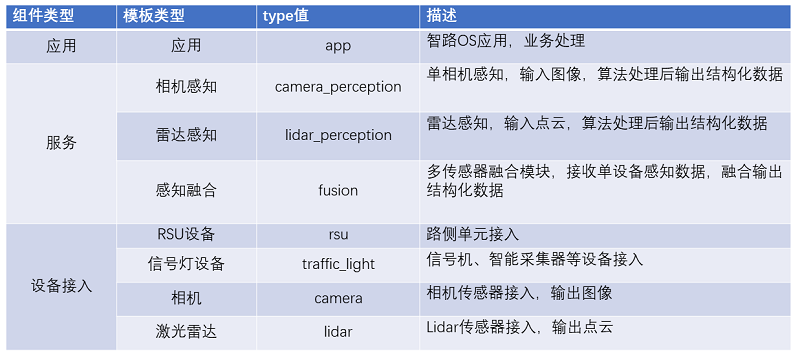

# AirOS Package Toolkit

## 1 简介
智路os包管理工具airospkg，功能包含创建工程模板、编译、发布、安装、删除软件包。
airospkg -h 参数显示使用帮助。
```bash
Usage
   airospkg [option] [-name] [-type] [-file] [-out]

option:
  create -name [package_name] -type [package_type]
      -name    required,value is letters, numbers,the underscore character and size <=50
      -type    required,value is [app camera_perception lidar_perception fusion rsu traffic_light camera lidar]

  make -type [compile_type]  -name [package_name]
      -type    required,value is [cmake bazel]
      -name    optional,package name

  release -name [package_name] -out [out_name]
      -name    optional,package name
      -out    optional,default output.tar.gz format:xxx.tar.gz

  install -file [package_file]
      -file    required,package file

  remove -name [package_name]
      -name    required,package name

  run [value]
      -name    required,value is the package name that is installed
      -type    required,value is [app camera_perception lidar_perception fusion rsu traffic_light camera lidar]
```

## 2 创建工程模板
使用create选项创建一个工程模板，包括源文件(cc)、头文件(h)、编译文件(BUILD)、配置文件和版本文件。
- -name参数配置工程的名称。
- -type参数配置工程的类型
使用该命令将会在/home/airos/projs/目录下生成指定的工程。
```bash
airospkg create -name [package_name] -type [package_type]
```
工程类型包括：



## 3 编译源代码
在创建工程的目录使用make选项进行软件包编译，编译的产出在output目录下。
- -type 参数配置使用的编译类型 ，必选。值为cmake、bazel。
- -name 参数配置需要编译的软件包，可选。如果没有使用-name参数，默认的工作录为当前目录。
```bash
airospkg make -type [compile_type] -name [package_name]
```
## 4 发布软件包
在创建工程的目录使用release选项发布软件包，发布的软件包为当前目录下的output.tar.gz文件。
- -out 参数配置发布软件包的文件名，可选，默认是output.tar.gz.
- -name 参数配置需要编译的软件包，可选。如果没有使用-name参数，默认的工作录为当前目录。
```bash
airospkg release -name [package_name] -out [out_name]
```

## 5 安装软件包
使用install选项和指定的软件包文件将软件包安装到指定的目录。
```bash
airospkg install -file=output.tar.gz
```

## 6 运行软件
run选项用来运行软件包
- -name参数配置工程的名称。
- -type参数配置工程的类型
```bash
airospkg run -name [package_name] -type [package_type]
```

## 7 删除已安装软件包
remove选项用来删除已安装的软件包。
```bash
airospkg remove -name=perfusion
```
