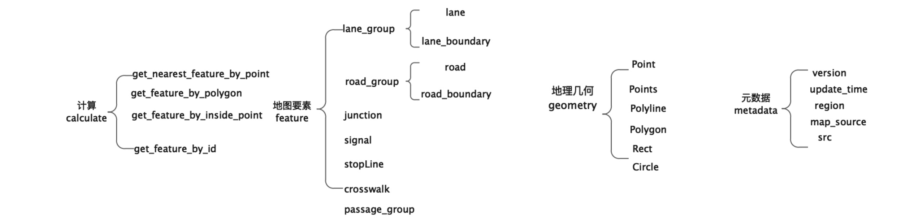
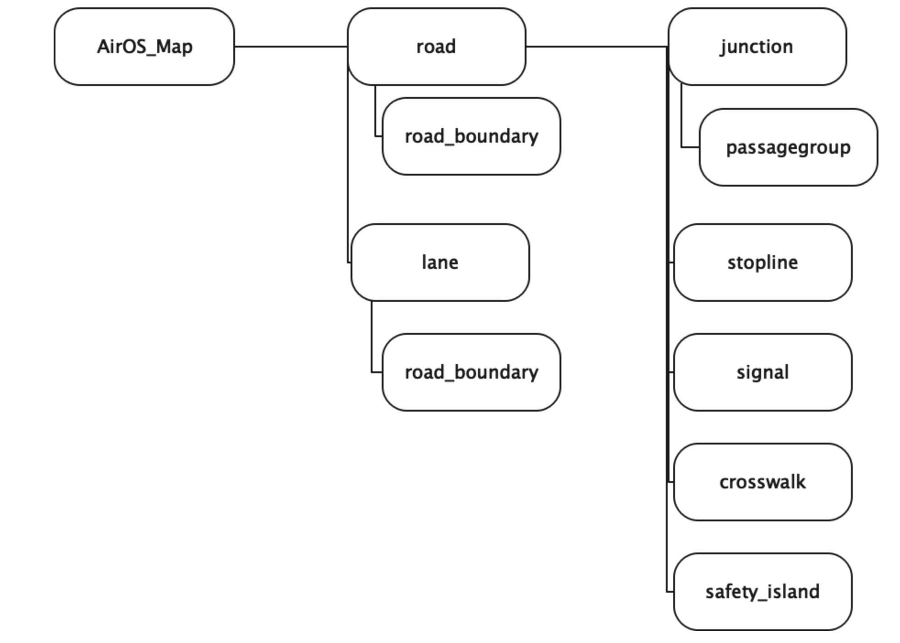
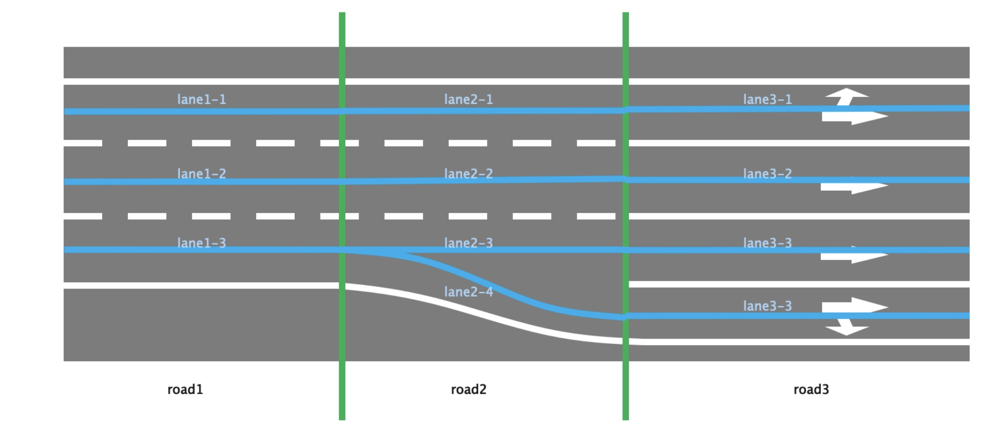
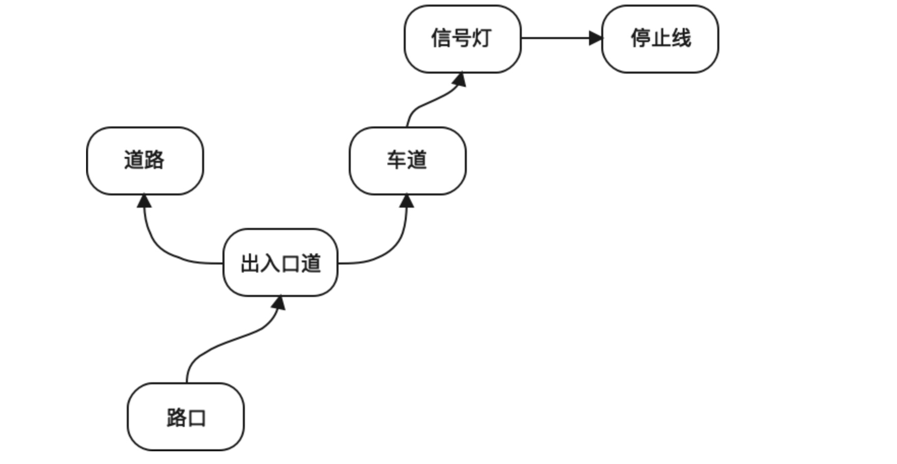

# 介绍
智路OS是面向车端提供的c-v2x车路协同应用框架，其中地图引擎作为服务层的重要组成，负责读取地图数据，为应用层提供基于高精度地图的地图要素数据服务，服务于路侧标定、感知、事件等多个功能模块。
> 地图数据规格基于ApolloAuto的地图规格，结合车路协同业务进行了部分要素的拆分重组，使其更便于路侧功能模块对地图数据的需求。

# 版本概述
## 地图引擎1.0preview版本
Air OS中的地图模块中的地图要素基本上是以扁平化的方式进行数据组织的，目前是降低地图整体的复杂度，保留重要的地图要素，后续版本根据其他模块的需要来增加，要素之间的关联关系通过属性表进行记录。
## 地图引擎接口


## 地图数据组织结构

```
 AirOS_Map
 |-- road #道路
 |-- road_boundary #道路边界线
 |-- lane #车道
 |-- lane_boundary #车道边界线
 |-- junction #路口
 |-- passagegroup #出入口道
 |-- signal #信号灯
 |-- stopline #停止线
 |-- crosswalk #人行横道
 |-- safety_island #安全岛

```

# 地图内容简介
## 道路road
道路中心线记录在road中，road与lane保持相同的打断逻辑，并记录road包含的所有的lane的编号；road中记录着左右边界线（road_boundary）与车道的附属关系。

## 车道lane
车道中心线记录在lane中，记录lane所属road编号，在turn中记录车道当前的转向关系，在plane_turn中记录下个连接的车道的转向关系。



## 路口junction
路口的区域范围一定会包含停止线、人行横道等要素，并记录路口与出入口道的关联关系。
## 出入口道 passagegroup
每个方向的入口和出口包含的车道信息，仅在与junction面相交处标记passagegroup的类型,其余其他要素的关联关系如下图所示



## 信号灯 signal
信号灯包含每个灯组的位置和控制的方向类型，同时记录与停止线的关联关系。
## 停止线 stopline
记录停止线的位置与唯一编号
## 人行横道 crosswalk
记录人行横道外包围框与唯一编号
## 安全岛 safety_island
记录安全岛的投影面与唯一编号